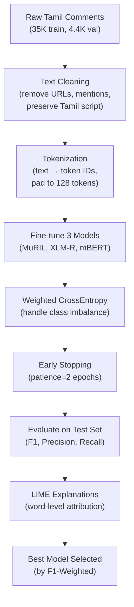

# Tamil Hate Speech Detection — Concepts & Code Explanation

This document explains **every key ML/NLP concept** used in [train_colab.ipynb](file:///e:/hate_speech/train_colab.ipynb) and walks through how the code implements them.

---

## 1. The Big Picture — What Are We Doing?

We are building a **multi-class text classifier** that takes a social media comment (in Tamil / code-mixed Tamil-English) and predicts one of 6 categories:

```
Input:  "Dei Rajini pavam da ne varaven poraven..."
Output: Label 3 → Offensive_Targeted_Group
```

The approach is **Transfer Learning with Transformer models** — we take pre-trained multilingual language models and fine-tune them on our specific Tamil dataset.

---

## 2. Core Concepts

### 2.1 Transformer Architecture

All three models (MuRIL, XLM-RoBERTa, mBERT) are based on the **Transformer** architecture (Vaswani et al., 2017). Key ideas:

```
┌─────────────────────────────────────────┐
│           TRANSFORMER ENCODER           │
│                                         │
│  Input Tokens → Embeddings              │
│       ↓                                 │
│  [Self-Attention] ← "Which words        │
│       ↓              should attend       │
│  [Feed-Forward]      to which?"         │
│       ↓                                 │
│  (Repeat × 12 layers)                   │
│       ↓                                 │
│  Contextual Representations             │
│       ↓                                 │
│  [CLS] token → Classification Head      │
│       ↓                                 │
│  Softmax → Class Probabilities          │
└─────────────────────────────────────────┘
```

- **Self-Attention**: Each word looks at every other word in the sentence to understand context. "Bank" means something different in "river bank" vs "bank account" — self-attention captures this.
- **Multi-Head Attention**: Multiple attention "heads" run in parallel, each learning different relationship patterns (e.g., one head learns syntax, another learns semantics).
- **Positional Encoding**: Since Transformers process all tokens at once (not sequentially like RNNs), position information is injected via embeddings.
- **[CLS] Token**: A special token prepended to every input. After passing through all layers, its representation is used as a summary of the entire sentence for classification.

### 2.2 The Three Pre-trained Models

| Model | Full Name | Why It's Used |
|-------|-----------|---------------|
| **MuRIL** | Multilingual Representations for Indian Languages | Specifically pre-trained on 17 Indian languages including Tamil. Best for Indian language tasks. |
| **XLM-RoBERTa** | Cross-lingual Language Model - RoBERTa | Pre-trained on 100 languages with a larger dataset. Strong cross-lingual transfer. |
| **mBERT** | Multilingual BERT | Original multilingual BERT, trained on 104 languages. Good baseline. |

All three were **pre-trained** on massive amounts of unlabeled text using **Masked Language Modeling (MLM)** — the model learns language by predicting randomly masked words:

```
Input:  "I [MASK] this movie"
Target: "I love this movie"
         ^^^^
         Model learns to predict "love"
```

This gives the model a deep understanding of grammar, semantics, and context — without needing any labeled data.

### 2.3 Transfer Learning & Fine-Tuning

This is the most important concept in the entire notebook.

```
┌──────────────────────────────────────────────────┐
│  PHASE 1: Pre-training (already done by Google)  │
│                                                  │
│  Billions of text → MLM task → Language model    │
│  "The model learns how language works"           │
├──────────────────────────────────────────────────┤
│  PHASE 2: Fine-tuning (what THIS notebook does)  │
│                                                  │
│  35K Tamil comments → Classification task        │
│  "The model learns what hate speech looks like"  │
└──────────────────────────────────────────────────┘
```

**Why not train from scratch?**
- We only have ~35K samples — far too few to learn language from scratch
- Pre-trained models already understand Tamil grammar, code-mixing patterns, and word meanings
- Fine-tuning only adjusts the model slightly for our specific task
- This gives much better results with less data and less compute

### 2.4 Tokenization

Before text goes into a model, it must be converted to numbers:

```
Text:     "படம் நல்லா இருக்கு"
           ↓ Tokenizer
Tokens:   ["பட", "##ம்", "நல்", "##லா", "இருக்", "##கு"]
           ↓ Token IDs
IDs:      [1045, 2387, 5621, 8934, 3201, 7654]
           ↓ Padding to max_length=128
Padded:   [1045, 2387, 5621, 8934, 3201, 7654, 0, 0, 0, ...]
```

Key parameters in the code:
- **`max_length=128`**: All inputs are padded/truncated to 128 tokens
- **`padding='max_length'`**: Short texts get `[PAD]` tokens appended
- **`truncation=True`**: Long texts are cut at 128 tokens

Each model has its **own tokenizer** because they were pre-trained with different vocabularies (e.g., MuRIL has a better Tamil vocabulary than mBERT).

### 2.5 Class-Weighted Cross-Entropy Loss

> [!IMPORTANT]
> This is a critical concept — the dataset is **heavily imbalanced**. Most samples are `Not_offensive`, while minority classes like `Offensive_Targeted_Other` have very few examples.

**Standard Cross-Entropy** treats all classes equally, which means the model can get 80%+ accuracy by just predicting "Not_offensive" for everything.

**Weighted Cross-Entropy** assigns higher loss penalties to rare classes:

```
Class Distribution (approx):
  Not_offensive:         ~70%  →  weight: LOW   (≈0.5)
  Offensive_Untargeted:  ~10%  →  weight: HIGH  (≈3.5)
  Off_Individual:        ~8%   →  weight: HIGH  (≈4.4)
  Off_Group:             ~6%   →  weight: HIGH  (≈5.8)
  Off_Other:             ~2%   →  weight: VERY HIGH (≈17.5)
  not-Tamil:             ~4%   →  weight: HIGH  (≈8.8)
```

The formula used is:

```
weight[class_i] = total_samples / (num_classes × count_of_class_i)
```

This forces the model to pay more attention to rare offensive classes, which is crucial for a hate speech detector — **missing an offensive post is worse than a false alarm**.

### 2.6 Gradient Accumulation

```python
per_device_train_batch_size=16
gradient_accumulation_steps=2
# Effective batch size = 16 × 2 = 32
```

GPUs have limited memory. Instead of using a large batch of 32 at once:
1. Process 16 samples, compute gradients (don't update weights yet)
2. Process another 16 samples, compute gradients
3. **Accumulate** both sets of gradients, then update weights

This simulates a larger batch size without needing more GPU memory.

### 2.7 Learning Rate Warmup & Decay

```python
learning_rate=2e-5
warmup_ratio=0.1
weight_decay=0.01
```

- **Learning Rate (`2e-5`)**: Very small because we're fine-tuning. Large LR would destroy the pre-trained knowledge ("catastrophic forgetting").
- **Warmup (`0.1`)**: For the first 10% of training, the LR gradually increases from 0 → 2e-5. This prevents large, destructive updates at the start when gradients are noisy.
- **Weight Decay (`0.01`)**: A form of regularization — slightly shrinks weights each step to prevent overfitting.

```
Learning Rate Schedule:
  LR ↑
     │    /‾‾‾‾‾‾‾‾‾‾‾‾‾‾‾‾‾‾\
     │   /                      \
     │  /                        \
     │ /                          \
     └──────────────────────────────→ Steps
       ↑ warmup    training    decay ↑
```

### 2.8 Mixed Precision Training (FP16)

```python
fp16=True
```

Normally, model parameters are stored as 32-bit floats. FP16 uses **16-bit floats** instead:
- **2× less GPU memory** → can fit larger batches
- **Faster computation** on NVIDIA tensor cores
- Minimal accuracy loss (critical operations stay in FP32)

### 2.9 Early Stopping

```python
EarlyStoppingCallback(early_stopping_patience=2)
load_best_model_at_end=True
metric_for_best_model='f1_weighted'
```

- The model trains for up to 5 epochs
- After each epoch, it evaluates on the validation set
- If `f1_weighted` doesn't improve for **2 consecutive epochs**, training stops early
- The **best** checkpoint (not the last one) is kept

This prevents overfitting — the model stops before it starts memorizing training data.

### 2.10 Evaluation Metrics

| Metric | What It Measures | Why It Matters |
|--------|------------------|----------------|
| **Accuracy** | % of correct predictions | Misleading when classes are imbalanced |
| **Precision** | Of all predicted positive, how many are truly positive? | "When the model says offensive, is it right?" |
| **Recall** | Of all actual positives, how many did we catch? | "Does the model miss offensive posts?" |
| **F1 Score** | Harmonic mean of Precision & Recall | Balances both concerns |
| **F1 Macro** | Average F1 across all classes (unweighted) | Treats rare classes equally |
| **F1 Weighted** | Average F1 weighted by class frequency | Primary metric — accounts for imbalance |

### 2.11 LIME Explainability

**LIME** (Local Interpretable Model-agnostic Explanations) explains **why** the model made a specific prediction:

```
Input: "Dei Rajini pavam da ne karithuppatha koraiya pesittu erukkan"

LIME Output:
  "karithuppatha" → +0.45 (strongly pushes toward Offensive)
  "pavam"         → -0.12 (pushes toward Not_offensive)
  "Dei"           → +0.08 (slightly offensive indicator)
```

How it works:
1. Take the input text
2. Create ~500 perturbed versions by randomly removing words
3. Get the model's prediction for each perturbed version
4. Fit a simple linear model to learn which words matter most
5. The linear weights show each word's contribution to the prediction

---

## 3. Code Walkthrough — Section by Section

### Section 1-2: Setup & Data Loading

```python
dataset = load_dataset('community-datasets/offenseval_dravidian', 'tamil')
```

Downloads the Tamil OffensEval Dravidian dataset from HuggingFace Hub (35K train + 4.4K validation).

**Text Cleaning** ([`clean_text()`](file:///e:/hate_speech/train_colab.ipynb)):
- Removes URLs, @mentions
- Strips hashtags (keeps the word)
- Removes special characters but **preserves Tamil Unicode** (`\u0B80-\u0BFF`)
- Lowercases only English letters (Tamil has no case)
- Collapses whitespace

**Data Split**: The original validation set is split 50/50 into validation and test sets, giving us 3 splits for proper evaluation.

---

### Section 3: Training Utilities

#### [compute_metrics()](file:///e:/hate_speech/train_colab.ipynb) — Evaluation Function

```python
def compute_metrics(eval_pred):
    logits, labels = eval_pred
    preds = np.argmax(logits, axis=-1)  # Convert logits → predicted class
    # Calculate accuracy, F1 (macro & weighted), precision, recall
```

Called automatically after each epoch. The `logits` are raw model outputs (6 scores per sample), and `argmax` picks the highest-scoring class as the prediction.

#### [WeightedTrainer](file:///e:/hate_speech/train_colab.ipynb) — Custom Loss Function

```python
class WeightedTrainer(Trainer):
    def compute_loss(self, model, inputs, return_outputs=False, **kwargs):
        labels = inputs.pop('labels')       # 1. Remove labels from input
        outputs = model(**inputs)            # 2. Forward pass (no labels)
        logits = outputs.logits              # 3. Get raw predictions
        loss_fct = nn.CrossEntropyLoss(      # 4. Weighted loss
            weight=self.class_weights.to(logits.device)
        )
        loss = loss_fct(logits, labels)      # 5. Compute loss
        return (loss, outputs) if return_outputs else loss
```

This overrides the default `Trainer.compute_loss` to inject class weights. The key trick: **pop labels out** so the model doesn't compute its own (unweighted) loss internally.

#### [compute_class_weights()](file:///e:/hate_speech/train_colab.ipynb) — Inverse Frequency Weights

```python
weights = total_samples / (num_classes × count_per_class)
```

Rare classes get higher weights → bigger loss penalty when misclassified → model learns to pay attention to them.

---

### Section 4: Training Loop

For each of the 3 models, the code:

```
1. Load tokenizer for the specific model
2. Tokenize all texts (convert text → token IDs)
3. Load pre-trained model + add classification head (6 outputs)
4. Compute class weights from training data
5. Configure training hyperparameters
6. Train with WeightedTrainer + EarlyStoppingCallback
7. Save best model
8. Clean up GPU memory (del model, torch.cuda.empty_cache())
```

The model architecture during fine-tuning:

```
┌────────────────────────────────────┐
│  Pre-trained Transformer (12 layers)│ ← Weights from pre-training
│  (MuRIL / XLM-R / mBERT)          │    (slightly updated)
├────────────────────────────────────┤
│  Classification Head               │ ← NEW, trained from scratch
│  Linear(768 → 6) + Softmax         │
└────────────────────────────────────┘
    Output: [0.02, 0.05, 0.80, 0.08, 0.03, 0.02]
             ↑ probabilities for each of 6 classes
```

The 768-dimensional `[CLS]` representation is fed into a new linear layer that maps it to 6 class scores.

---

### Section 5: Test Set Evaluation

```python
model.eval()                          # Disable dropout
with torch.no_grad():                 # No gradient computation (saves memory)
    preds = model(**enc).logits.argmax(-1)  # Get predictions
```

- **`model.eval()`**: Switches off dropout and batch normalization updates (used only during training)
- **`torch.no_grad()`**: Tells PyTorch not to track operations for backpropagation — saves memory and speeds up inference
- **Confusion Matrix**: A heatmap showing where the model confuses classes (e.g., predicts "Not_offensive" when true label is "Offensive_Targeted_Group")

---

### Section 6-7: Comparison & Error Analysis

- **Bar chart** comparing all 3 models on 5 metrics
- **False negatives** (dangerous): offensive posts classified as not offensive
- **False positives**: non-offensive posts wrongly flagged
- **Per-class error rate**: shows which categories the model struggles with most

---

### Section 8: LIME Explanations

```python
explainer = LimeTextExplainer(class_names=LABEL_NAMES)
exp = explainer.explain_instance(
    text,                    # The input to explain
    predict_proba,           # Model's probability function
    num_features=10,         # Show top 10 important words
    num_samples=500          # Create 500 perturbed versions
)
```

Generates HTML reports showing which words pushed the model toward or away from each class. This is essential for:
- **Debugging**: Understanding why the model makes mistakes
- **Trust**: Showing stakeholders the model's reasoning
- **Bias detection**: Catching if the model relies on problematic features

---

## 4. End-to-End Flow Summary



## 5. Key Hyperparameters Summary

| Parameter | Value | Why |
|-----------|-------|-----|
| `max_length` | 128 | Social media posts are short; 128 tokens is enough |
| `batch_size` | 16 (×2 accumulation = 32 effective) | Fits T4 GPU memory |
| `learning_rate` | 2e-5 | Standard for BERT fine-tuning; prevents catastrophic forgetting |
| `epochs` | 5 (with early stopping) | Enough to converge; early stopping prevents overfitting |
| `warmup_ratio` | 0.1 | Stabilizes training at the start |
| `weight_decay` | 0.01 | Light regularization |
| `fp16` | True | 2× memory savings on GPU |
| `patience` | 2 | Stops if no improvement for 2 epochs |
| `metric` | f1_weighted | Best single metric for imbalanced classification |
